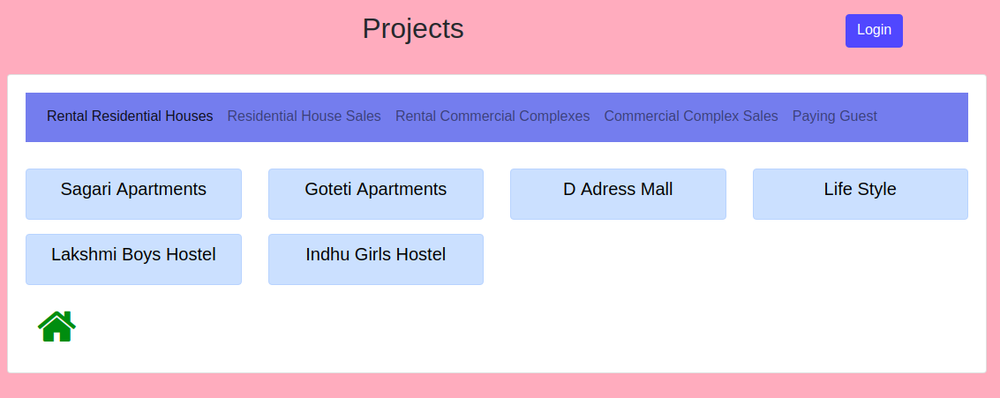
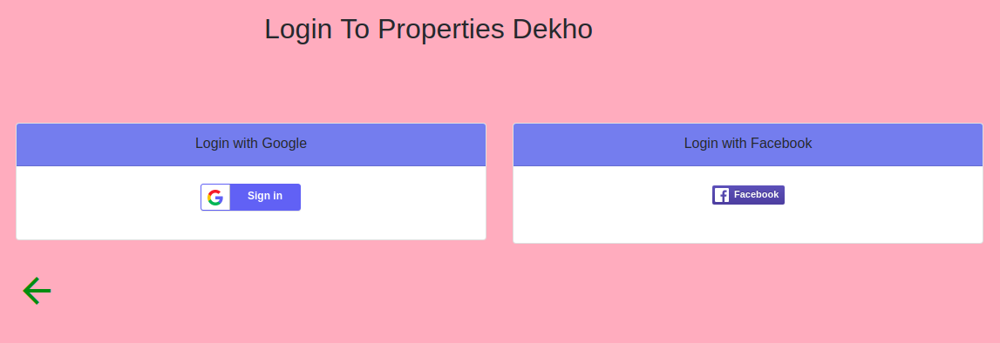
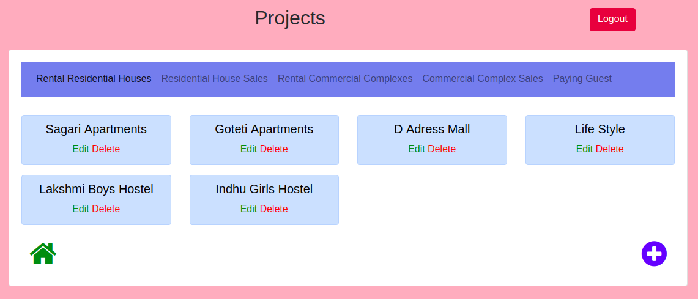
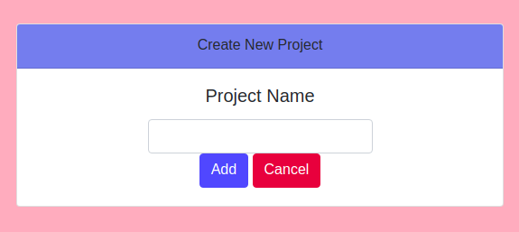
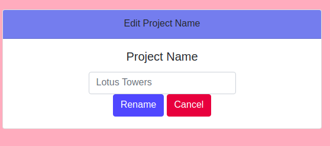
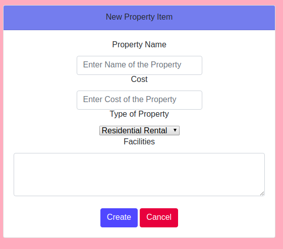
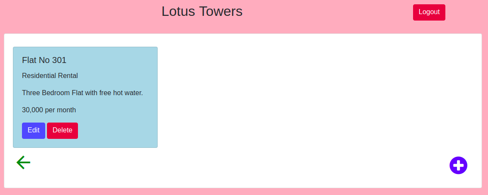
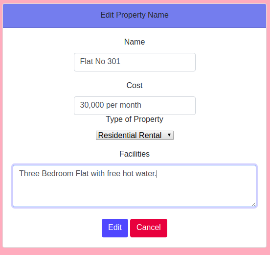

# Project 3: Item Catalog

Item Catalog project, part of the Udacity [Full Stack Web Developer
Nanodegree](https://www.udacity.com/course/full-stack-web-developer-nanodegree--nd004).

## What it is and does
This Project is a website where One can add New Projects related to Land and also can add many number of properties under each Project.
The user can login via Google or Facebook in order to add their own Projects and Properties. They can specify number of Properties each with different types like :
Residential Rental, Residential Sale, Commercial Rental, Commercial Sale, Paying Guest. A user can edit and delete their own Projects or Properties.
### Table of Contents
 
* [Required Libraries and Dependencies](#required-libraries-and-dependencies)
* [Project contents](#project-contents)
* [Demo](#demo)
* [Templates](#templates)
* [How to Run the Project](#how-to-run-the-project)
* [Website Images](#crud-for-projects)
* [JSON Endpoints](#json-endpoints)
## Required Libraries and Dependencies
* Python 2.7.x
* [SQLAlchemy](http://www.sqlalchemy.org/) 0.8.4 or higher (a Python SQL toolkit)
* [Flask](http://flask.pocoo.org/) 0.10.1 or higher (a web development microframework)
* The following Python packages:
    * oauth2client
    * requests
    * httplib2


You can run the project in a Vagrant managed virtual machine (VM) which includes all the
required dependencies (see below for how to run the VM). For this you will need
[Vagrant](https://www.vagrantup.com/downloads) and
[VirtualBox](https://www.virtualbox.org/wiki/Downloads) software installed on your
system.

## Project contents
This project consists for the following files in the `properties_dekho` directory:
* `database_setup.py` - Defines the database classes and creates an empty database with name `propertieswithusers.db`.
* `create_statements_with_users.py` - Inserts a selection of Projects related to land with their properties into the database.
* `final_project.py` -  The main Python script that serves the website.
* `README.md` - This read me file.
* `/static` - Directory containing CSS and Javascript for the website.
* `/templates` - Directory containing the HTML templates for the website, using
        the [Jinja 2](http://jinja.pocoo.org/docs/dev/) templating language for Python.
        See next section for more details on contents.

## Demo
Click this link to view the website: http://vamsikrish04.pythonanywhere.com

### Templates
The `/templates` directory contains the following files, written in HTML and the Jinja2 templating language:

* `publicProjects.html` - This webpage shows all the Projects when the user is not logged in. The user cannot edit or delete any Project.
* `publicProperties.html` - This webpage shows all the Properties of a specific Project when the user is not logged in. The user cannot edit or delete any Property.
* `login.html` - A login page featuring OAuth Goolge+ and Facebook login buttons.
* `showProjects.html` - This webpage shows all the Projects when the user is logged in.
* `showProperties.html` - This webpage shows all the Properties of a specific Project when the user is logged in.
* `newProject.html` - This webpage is used to create a new Project.
* `newPropertyItem.html` - This webpage is used to create a new Property which is under a Project.
* `editProject.html` - This webpage is used to edit name of  the Project.
* `editPropertyItem.html` - This webpage is used to edit Property details under a specific Project.
* `deleteProject.html` - This webpage is used to delete the Project.
* `deletePropertyItem.html` - This webpage is used to delete a Property under a specific Project.


## How to Run the Project
Download the project zip file to you computer and unzip the file. Or clone this
repository to your desktop.

Open the text-based interface for your operating system (e.g. the terminal
window in Linux, the command prompt in Windows).

Navigate to the project directory and then enter the `vagrant` directory.

### Bringing the VM up
Bring up the VM with the following command:

```bash
vagrant up
```

The first time you run this command it will take awhile, as the VM image needs to
be downloaded.

You can then log into the VM with the following command:

```bash
vagrant ssh
```

More detailed instructions for installing the Vagrant VM can be found
[here](https://www.udacity.com/wiki/ud197/install-vagrant).

### Make sure you're in the right place
Once inside the VM, navigate to the t directory properties_dekho with this command:

```bash
cd /vagrant/properties_dekho
```

### OAuth setup
In order to log in to the web app, you will need to get either a Google+ or Facebook
(or both) OAuth app ID and secret. For Google, go to the
[Google Developers Console](https://console.developers.google.com/) and for Facebook,
go to [Facebook Login](https://developers.facebook.com/products/login).

Once you have your credentials, put the IDs and secrets in the `fb_client_secrets.json`
file for Facebook and `client_secrets.json` for Google.


You will now be able to log in to the app.

### Run database_setup.py
```bash
python database_setup.py
```
To create an empty database with name `propertieswithusers.db`

### Run create_statements_with_users.py
```bash
python create_statements_with_users.py
```
to populate the database with some projects with properties having a dummy user.

### Run final_project.py
```bash
python final_project.py
```

It then starts a web server that serves the application. To view the application,
go to the following address using a browser on the host system:

```
http://localhost:5000/
```

You should see the  Projects with their Properties were added to the database. Go ahead and explore the web site. To add a Project or Property, you'll need to log in first with either a Google or Facebook account.

#### --------------------------------------
#### CRUD for Projects
#### --------------------------------------

`/` or `/projects` - Returns Projects page with all Projects and recently added items without CRUD operations ability to the user.



`/login` - Login Page




`/` or `/projects` - Returns Projects page with all Projects and recently added items with CRUD operations ability to the user after Login.




`/project/new` - Allows user to add a New Project



`/project/<int:project_id>/edit` - Allows user to Edit an existing Project



`/project/<int:project_id>/delete` - Allows user to Delete an existing Project


#### --------------------------------------
#### CRUD for Properties
#### --------------------------------------


`/project/<int:project_id>/menu/new` - Allows user to add a New Property Item



`/project/<int:project_id>/menu` - Shows Property Items of a Project


`/project/<int:project_id>/menu/<int:property_id>/edit` - Allows user to Edit details of an  existing Property Item


`/project/<int:project_id>/menu/<int:property_id>/delete` - Allows user to Delete an existing Property Item


## JSON Endpoints
The following are open to the public:

All Projects JSON: `/projects/JSON`
    - To Show All the Projects with their details.

 Specific Project JSON: `/projects/<int:project_id>/JSON`
    - To show details of a  Specific Project.

All Properties of A Project JSON: `/project/<int:project_id>/menu/JSON`
    - To Show details of all Properties of a Project

Specific Property of A Project JSON: `/project/<int:project_id>/menu/<int:property_id>/JSON`
    - To Show details of a specific Property of a Project

### Shutting the VM down
When you are finished with the VM, press `Ctrl-D` to logout of it and shut it down
with this command:

```bash
vagrant halt
```
